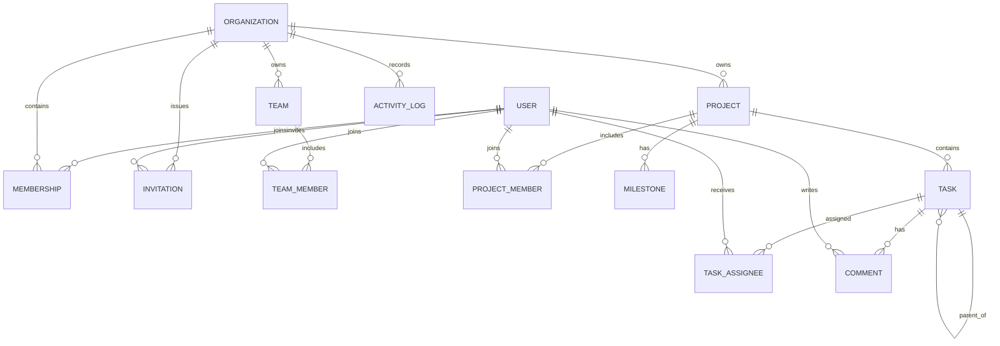

# WorkSphere initial data model

```mermaid
erDiagram
  USER ||--o{ MEMBERSHIP : joins
  ORGANIZATION ||--o{ MEMBERSHIP : contains
  ORGANIZATION ||--o{ INVITATION : issues
  USER ||--o{ INVITATION : invites
  ORGANIZATION ||--o{ TEAM : owns
  TEAM ||--o{ TEAM_MEMBER : includes
  USER ||--o{ TEAM_MEMBER : joins
  ORGANIZATION ||--o{ PROJECT : owns
  PROJECT ||--o{ PROJECT_MEMBER : includes
  USER ||--o{ PROJECT_MEMBER : joins
  PROJECT ||--o{ MILESTONE : has
  PROJECT ||--o{ TASK : contains
  TASK ||--o{ TASK : parent_of
  TASK ||--o{ TASK_ASSIGNEE : assigned
  USER ||--o{ TASK_ASSIGNEE : receives
  TASK ||--o{ COMMENT : has
  USER ||--o{ COMMENT : writes
  ORGANIZATION ||--o{ ACTIVITY_LOG : records
```

The Prisma schema is authoritative. This is a simplified relationship overview.
